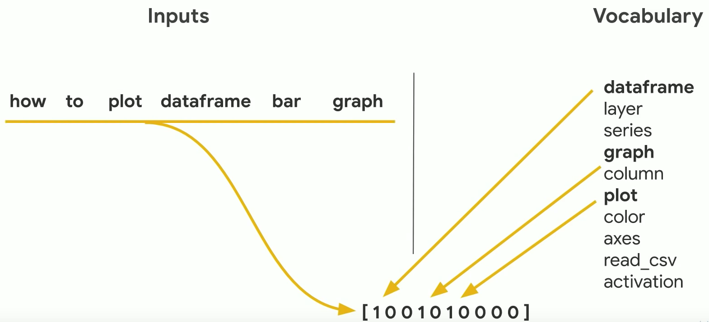

*Dans cet article, nous découvrons l'analyse textuelle et les modélisations possibles en NLP.*

---

**— Sommaire**

**[I. Du texte à la matrice](#one)**  

**[II. Preprocessing](#two)**  
• [A. Récupération du corpus](#two-a)  
• [B. Nettoyage du corpus](#two-b)

**[III. Modeling](#three)**  
• [A. Modélisation automatique de sujet : LDA, NMF](#three-a)  

---

## Intro.

Le *Natural Language Processing* (ou *NLP*) est un ensemble de méthodes informatiques permettant de <mark>comprendre ou d'analyser le langage humain</mark>. On parle de *corpus* pour désigner l'ensemble des documents analysés.

On peut avoir une approche purement statistique (on parle alors de lexicométrie) en étudiant des données telles que les occurrences des mots par exemple.  
Plus largement, le NLP va permettre de modéliser des motifs dans le texte en s'intéressant à la co-occurence de certains mots par exemple. Ainsi, si il est extrêmement difficile de trouver des règles tout à fait générales en NLP, le Machine Learning va permettre de les découvrir et de les appliquer aux corpus suivants.

Voici quelques sujets sur lesquels travailler avec du NLP :
- l’analyse de sentiments,
- la modélisation de thématiques,
- la traduction automatique...

---

## I. Du texte à la matrice

Comme introduit dans mon article sur le Machine Learning, il est nécessaire de représenter nos données sous forme de matrices pour - *in fine* - leur appliquer des modèles prédictifs.
Prenons le corpus suivant : <code>"Je suis un homme. Un homme souvent paradoxal."</code>.  
Il est possible de représenter ce corpus sous forme de vecteur. A chaque fois qu’un nouveau mot apparaît, il est ajouté au vecteur :
<code>[je suis un homme souvent paradoxal]</code>

Pour décrire une phrase, on va ensuite attribuer 1 si le mot est présent, 0 sinon.
<code>"Un homme souvent paradoxal"</code> devient <code>[0 0 1 1 1 1]</code>.



Par ailleurs, forcer le vecteur à attribuer une position fixe à chaque mot commence à répondre à une problématique inhérente au NLP. Plus le corpus est grand, plus le vecteur va contenir de mots et donc devenir coûteux d’un point de vue calcul machine. Il existe donc des méthodes permettant, par exemple, de regrouper les mots sous la forme de leur radical : <code>[découper, coupant, couperaient]</code> deviennent <code>[coupe]</code>. Cela permet de limiter le temps de calcul tout en conservant (généralement) le sens des mots. Mais passons à la pratique.

---

## II. Preprocessing

### A. Récupération du corpus
La première étape consiste à récupérer le corpus sur lequel on souhaite travailler. Pour se faire, il existe différentes méthodes qui ne seront pas décrites en détail dans cet article.  
On pourrait par exemple récupérer des fichiers de données sur des plateformes opendata (comme Kaggle) ou scraper des pages web pour en extraire le contenu (voir mon article sur le web mining).  
Pour avoir une première intuition des fonctions que nous allons utiliser, prenons les phrases suivantes en guise de corpus : 

```python
# Import de NLTK, librairie phare du NLP
import nltk
nltk.download('punkt')

# Génération du corpus
corpus = "Ceci est une introduction à l’analyse textuelle. Do$nt l'analyse pour’rait po$$ser problème." 
```

On va maintenant se rapprocher de la représentation vectorielle attendue. Pour se faire, on peut *tokenizer* notre corpus.

- **La *tokenization*** : permet le découpage en mots des différents documents qui constituent le corpus.

```python
# Tokenization en vecteur de mots
print(nltk.word_tokenize(corpus))
```

Pour réduire la longueur de ce vecteur, nous allons utiliser la méthode du *bag-of-words*.

- **Le *bag-of-words*** : Pour que chaque occurence de mots ne viennent pas agrandir le vecteur, nous les regroupons en les ajoutant à leur première apparition. Cela va former un vecteur dont la longueur est <mark>l'ensemble du vocabulaire</mark> (c'est-à-dire des mots différents) <mark>dans l'ensemble des documents du corpus</mark>. Chaque document peut maintenant être décrit par ce même vecteur [a b c ...] avec a, b, c, ... le nombre d'occurences – dans le document – du mot représenté.

### B. Nettoyage du corpus
La deuxième étape consiste à nettoyer le texte pour le préparer à l’analyse.

Il s'agit de **normaliser** le vecteur de mots dans le but de supprimer des détails inutiles au dictionnaire qu’on souhaite construire (ponctuation, caractères spéciaux, conjugaison, mots ayant trop de poids dans le cadre d’un modèle prédictif de thématiques…). Pour cela, voici les méthodes les plus communément appliquer.

- **Les *Regex*** : (ou expressions régulières) qui permettent de filtrer les chaînes de caractères.

```python
# Application d’une regex pour se débarrasser des caractères inutiles
tokenizer = nltk.RegexpTokenizer(r'\w+')
print(tokenizer.tokenize(corpus))
```

- **Suppression des *stop-words*** : qui sont les mots très courants dans la langue étudiée ("et", "à", "le"... en français) et qui n'apportent pas réellement de valeur informative pour la compréhension du sens du texte.

- **Suppression des mots les plus fréquents** : pour ne garder que les mots qui permettent de distinguer le contenu d'un texte d'un autre.

- **La *lemmatisation*** : qui consiste à représenter les mots sous leur forme canonique. Les verbes conjugués vont être passés à l'infinitif, les noms au masculin singulier...

- **Le *stemming*** : qui permet de supprimer les préfixes/suffixes connus pour ne garder que la racine (donc la partie la plus porteuse de sens) des mots.

---

## Processing

- **Les *n-grams*** : sous-séquence de *n* éléments construite à partir d’une séquence donnée. La probabilité des éléments dans le texte est alors dépendante des éléments précédents et suivants. Cela permet notamment de prendre en compte une partie du contexte de la phrase.  
Par exemple, dans <code>"mourir de rire"</code> et <code>"mourir de faim"</code>, <code>"mourir"</code> ne véhicule pas la même idée (elle est positive dans le premier cas, négative dans le second).

- **Le *POS tagging* (Part of Speech tagging)** : qui associe aux mots d'une phrase leurs informations grammaticales.

...

---

## Modeling

### Modélisation automatique de sujet : LDA, NMF

L'objectif de ce type de modélisation de sujets est de récupérer de potentielles catégories pour des traitements ultérieurs. Cette modélisation offre surtout une meilleure compréhension de la structuration du texte en vue de la création de features (mettre l'accent sur certains mots, comprendre ce qui définit une catégorie, etc.).

```python
# Modélisation automatique de sujet avec le modèle LDA
from sklearn.decomposition import LatentDirichletAllocation

lda = LatentDirichletAllocation(n_components=20,
                                max_iter=5,
                                learning_method='online',
                                learning_offset=50,
                                random_state=0)
                                .fit(tf)
```

...