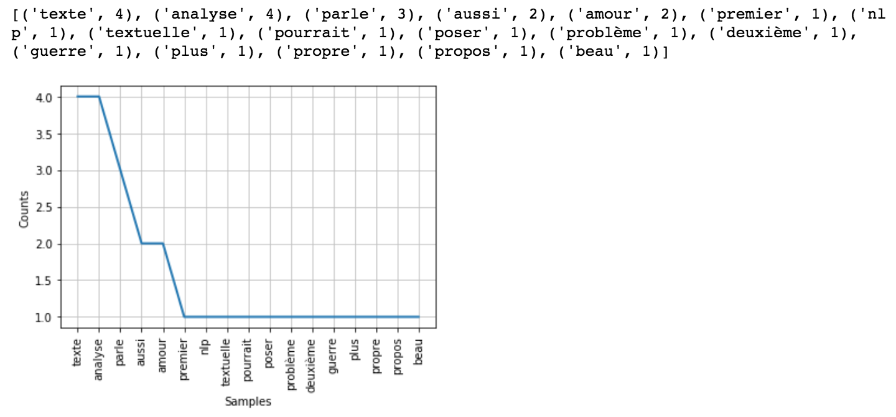

*Dans cet article, nous découvrons les fondamentaux du Natural Language Processing en se concentrant sur le preprocessing des données.*

---

**— Sommaire**

**[I. Introduction](#one)**  
• [A. Le Natural Language Processing](#one-a)  
• [B. Du texte à la matrice : le bag-of-words](#one-b)  

**[II. Preprocessing](#two)**  
• [A. Récupération du corpus](#two-a)  
• [B. La tokenization](#two-b)  
• [C. Reformatage (Regex, lowercase)](#two-c)  
• [D. Suppression des stop-words](#two-d)  
• [E. Les mots les plus fréquents](#two-e)  
• [F. La lemmatisation](#two-f)  
• [G. Le stemming](#two-g)

---

<a id="one"></a>
## I. Introduction

<a id="one-a"></a>
### A. Le Natural Language Processing

Le *Natural Language Processing* (ou *NLP*) est un ensemble de méthodes informatiques permettant de <mark>comprendre ou d'analyser le langage humain</mark>. On parle de *corpus* pour désigner l'ensemble des documents analysés.

On peut avoir une approche purement statistique (on parle alors de lexicométrie) en étudiant des données telles que les occurrences des mots par exemple.  
Plus largement, le NLP va permettre de modéliser des motifs dans le texte en s'intéressant à la co-occurence de certains mots par exemple. Ainsi, si il est extrêmement difficile de trouver des règles tout à fait générales en NLP, le Machine Learning va permettre de les découvrir et de les appliquer aux corpus suivants.


###### Looks fascinating, right?

Voici, entre autres, quelques sujets sur lesquels travailler avec du NLP :
- l’analyse de sentiments,
- la modélisation de thématiques,
- la traduction automatique...

<a id="one-a"></a>
### B. Du texte à la matrice : le *bag-of-words*

Comme introduit dans mon article sur le Machine Learning, il est nécessaire de représenter nos données sous forme de matrices pour - *in fine* - leur appliquer des modèles prédictifs.
Prenons le corpus suivant : <code>"Je suis un homme. Un homme souvent paradoxal."</code>.  
Il est possible de représenter ce corpus sous forme de vecteur. A chaque fois qu’un nouveau mot apparaît, il est ajouté au vecteur :
<code>[je suis un homme souvent paradoxal]</code>

Pour décrire une phrase, on va ensuite attribuer 1 si le mot est présent, 0 sinon.
<code>"Un homme souvent paradoxal"</code> devient <code>[0 0 1 1 1 1]</code>.

On forme ce qu'on appelle des *bag-of-words* !

- **Le *bag-of-words*** : Pour que chaque occurence de mots ne viennent pas agrandir le vecteur, nous les regroupons en les ajoutant à leur première apparition. Cela va former un vecteur dont la longueur est <mark>l'ensemble du vocabulaire</mark> (c'est-à-dire des mots différents) <mark>dans l'ensemble des documents du corpus</mark>. Chaque document pourra ainsi être décrit par ce même vecteur [a b c ...] avec a, b, c, ... le nombre d'occurences – dans le document – du mot représenté.

Par ailleurs, forcer le vecteur à attribuer une position fixe à chaque mot commence à répondre à une problématique inhérente au NLP. Plus le corpus est grand, plus le vecteur va contenir de mots et donc devenir coûteux d’un point de vue calcul machine. Il existe donc des méthodes permettant, par exemple, de regrouper les mots sous la forme de leur radical : <code>[découper, coupant, couperaient]</code> deviennent <code>[coupe]</code>. Cela permet de limiter le temps de calcul tout en conservant (généralement) le sens des mots. Mais passons à la pratique.

---

<a id="two"></a>
## II. Preprocessing

Dans cet article, j'ai choisi de travailler avec la librairie *NLTK*. Il en existe d'autres telles que les librairies *spaCy* et *Gensim* qui permettent elles aussi de réaliser la plupart des étapes qui vont suivre.

<a id="two-a"></a>
### A. Récupération du corpus

La première étape consiste à récupérer le corpus sur lequel on souhaite travailler. Pour se faire, il existe différentes méthodes qui ne seront pas décrites en détail dans cet article.  
On pourrait par exemple récupérer des fichiers de données sur des plateformes opendata (comme Kaggle) ou scraper des pages web pour en extraire le contenu ([voir mon article sur le scraping](https://quentin-monmousseau.netlify.com/WMXP/part-1/)).  
Pour avoir une première intuition des fonctions que nous allons utiliser, prenons les phrases suivantes en guise de corpus : 

```python
# Import de NLTK, librairie phare du NLP
import nltk
nltk.download('punkt')

# Génération du corpus
corpus = "Ceci est une introduction à l’analyse textuelle. Do$nt l'analyse pour’rait po$$ser problème." 
```

On va maintenant se rapprocher de la représentation vectorielle attendue. Pour se faire, on peut *tokenizer* notre corpus.

<a id="two-b"></a>
### B. **La *tokenization*** 

- **La *tokenization*** : permet le découpage en mots des différents documents qui constituent le corpus.

```python
# Tokenization en vecteur de mots
clean_corpus = nltk.word_tokenize(corpus)
```

Il est maintenant possible de nettoyer le texte pour le préparer à l’analyse.  
Il s'agit de **normaliser** le vecteur de mots dans le but de supprimer des détails inutiles au dictionnaire qu’on souhaite construire (ponctuation, caractères spéciaux, conjugaison, mots ayant trop de poids dans le cadre d’un modèle prédictif de thématiques…). Pour cela, voici les méthodes les plus communément appliquer.

<a id="two-c"></a>
### C. Reformatage (Regex, lowercase)

- **Les *Regex*** : (ou expressions régulières) permettent de filtrer les chaînes de caractères pour se débarasser de certains caractères inutiles comme des éléments de ponctuation.

```python
# Tokenization avec application d’une regex pour se débarrasser des caractères inutiles
tokenizer = nltk.RegexpTokenizer(r'\w+')
clean_corpus = tokenizer.tokenize(corpus)
```

On peut maintenant compter le nombre de mots qui composent le corpus.

```python
# Longueur du corpus (mots)
print(len(clean_corpus))
```

- **Le *lowercase*** : consiste à passer toutes les lettres des mots en minuscules. Ceci permet d'éviter qu'un même mot soit présent deux fois dans le vecteur (ex : <code>"Je"</code> et <code>"je"</code>).

```python
# Passage au lowercase
clean_corpus = [w.lower() for w in clean_corpus]
```

<a id="two-d"></a>
### D. **Suppression des *stop-words***

- **Suppression des *stop-words*** : qui sont les mots très courants dans la langue étudiée ("et", "à", "le"... en français) et qui n'apportent pas réellement de valeur informative pour la compréhension du sens du texte.

```python
from nltk.corpus import stopwords

# Stockage des stop-words français
stop_words = stopwords.words('french')

# Ajout manuel de stop-words
other_stop_words = ['dont', 'ceci']
for w in other_stop_words:
    stop_words.append(w)

print(stop_words)
```

```python
# Suppression des stop-words du corpus
clean_corpus = [w for w in clean_corpus if not w in stop_words]
```

Il est désormais intéressant de visualiser les mots les plus fréquents.

<a id="two-e"></a>
### E. Les mots les plus fréquents

```python
# Fréquence des mots
fdist1 = nltk.FreqDist(clean_corpus)
print(fdist1.most_common(50))
fdist1.plot(50)
```



A ce niveau, les mots les plus fréquents le sont souvent car ils sont présents dans tous les textes. Ils restent largement informatifs mais sont peu discriminants dans le cas où on souhaiterait trouver ce qui distingue les textes les uns des autres.

- **Suppression des mots les plus fréquents** : dans le cas où on souhaite distinguer des types de textes, il convient de supprimer les mots qu'ils ont en commun pour ne garder que ceux qui permettent de les distinguer.

```python
```

<a id="two-f"></a>
### F. La *lemmatisation*

- **La *lemmatisation*** : qui consiste à représenter les mots sous leur forme canonique. Les verbes conjugués vont être passés à l'infinitif, les noms au masculin singulier...

<a id="two-g"></a>
### G. Le *stemming*

- **Le *stemming*** : qui permet de supprimer les préfixes/suffixes connus pour ne garder que la racine (donc la partie la plus porteuse de sens) des mots.