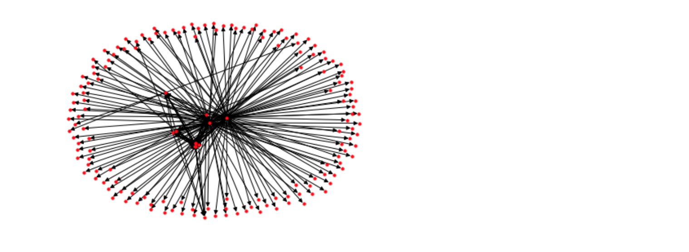

*Cet article vise à introduire à la collecte de données web, ou Web Mining, grâce au Scraping et au Crawling.*

---

**— Sommaire**

**[I. Le Scraping](#one)**  
**[II. Le Crawling](#two)**  

---

## Intro.

Le *Web Mining* est une branche spécifique du Data Mining qui s'intéresse aux données issues du web.

Ces données sont très intéressantes pour des problématiques liées au marketing ou aux sciences humaines. En effet, elles permettent de contourner les biais des méthodes expérimentales (préconçus, orientations des questions...) - ou encore le *paradoxe de Labov* - car contrairement aux données recueillies lors de questionnaires/entretiens, les personnes produisent les contenus spontanément.

En Web Mining, on analyse généralement trois types de données :
- Contenus du web avec le *Scraping*,
- Structure du web avec le *Crawling*,
- mais Usages du web (parcours utilisateurs, web analytics...), qu'on ne verra pas dans cet article,

### La limite des APIs web

Sur la plupart des gros sites web, des *APIs* sont mises à disposition pour pouvoir en récupérer les données. C'est par exemple le cas pour Twitter, Facebook ou Linkedin. Toutefois, certaines de ces APIs sont largement limitées (contenu innaccessible, rate limit, options payantes...). Autre problème, des sites moins importants, mais tout aussi intéressant à analyser, ne possèdent tout simplement pas d'API.
Pour récolter l'ensemble des données qui nous intéressent, il existe une solution puissante qui s'affranchit de ces limites : le *Scraping*.

---

<a id="one"></a>
## I. Le Scraping

*To scrape*, ou gratter en français, c'est l’art d’extraire des données directement depuis leur représentation visuelle. Lorsqu'on crée une page web, on va structurer son contenu avec du HTML. Du templating va permettre de formater et d'insérer des données dynamiques dans ces structures. Ainsi, dans le cas des pages web, on va scraper le HTML lui-même pour récupérer précisément les données souhaitées. D'une certaine manière, on procède à une rétro-ingénierie du processus de templating.

Pour commencer cette introduction au scraping, assurez-vous d'avoir installer les deux dépendances suivantes :
- <code>pip install requests</code>
- <code>pip install beautifulsoup4</code>

Nous allons commencer par récupérer le contenu HTML de la page web qui nous intéresse.

```python
# Import librairies
import requests # Requêtes aux pages web
from bs4 import BeautifulSoup # Scraping

# Requête à la page web
res = requests.get("http://www.echojs.com/")

# Récupération du contenu HTML de la page
soup = BeautifulSoup(res.text, 'html.parser')
print(soup)
```

Notre objectif est maintenant de récupérer les titres d'articles et leurs liens, contenus dans les balises <code>a</code>. Pour cela, on peut préciser le chemin qui mène à la balise qui nous intéresse à l'aide de la fonction <code>.select</code>.

```python
# Sélection de la balise
links = soup.select('article > h2 > a')
```

Une fois sélectionnés, on va stocker les couples titre/lien dans une liste en les ajoutant un par un avec la fonction <code>.append</code>. Pour préciser le contenu qui nous intéresse dans la balise ciblée, on utilise les fonctions <code>.get_text()</code> et <code>.get('href')</code> de BS4.

```python
# Initialisation d'une liste
data = []

# Remplissage de la liste avec les couples title/url
for link in links:
    data.append({
        'title': link.get_text(),
        'url': link.get('href')
    })

# Affichage de la liste
for couple in data:
    print('Name: {}\nLink: {}\n'.format(couple['title'], couple['url']))
```

Maintenant qu'on a réussi à récupérer les titres des articles et leur url, il ne nous reste plus qu'à stocker nos données. Ici dans un fichier .csv...

```python
import csv

# Ouverture d'un fichier csv
with open('./scraping.csv', 'w') as f:

    # Ecriture des intitulés des colonnes
    writer = csv.DictWriter(f, fieldnames=['title', 'url'])
    writer.writeheader()

    # Ecriture de chaque couple titre/url dans le fichier .csv
    for couple in data:
        writer.writerow(couple)
```

...ou ici au format .json.

```python
import json

# Initialisation d'un dictionnaire
data2 = []

# Remplissage du dictionnaire
for link in links:
    data2 = {
        'title': link.get_text(),
        'url': link.get('href')
    }

# Ouverture d'un fichier json et complétion
with open('./scraping.json', 'w') as f:
    json.dump(data, f, ensure_ascii=False, indent=2)
```

---

<a id="two"></a>
## II. Le Crawling

*To crawl*, ou ramper en français, c'est parcourir le web à l’aide d’un programme (bot, spider) en récupérant :
- les pages parcourues
- les liens entre elles

Si vous êtes familiés avec la notion de graphe, il apparaît évident qu'on constitue alors un réseau de pages qu'on va pouvoir analyser ([ici avec NetworkX](https://github.com/qmonmous/DataScience-X-Python/blob/master/Bonus2.%20Introduction%20%C3%A0%20l'analyse%20de%20r%C3%A9seau%20avec%20NetworkX/Th%C3%A9orie%20des%20graphes%20et%20Analyse%20de%20r%C3%A9seau.ipynb)).

Pour commencer cette introduction au crawling, assurez-vous d'avoir installer les dépendances suivantes :
- <code>pip install requests</code>
- <code>pip install urllib</code>
- <code>pip install beautifulsoup4</code>
- <code>pip install networkx</code>


```python
import requests # Requêtes aux pages web
from bs4 import BeautifulSoup # Scraping
from urllib.parse import urljoin # Reconstruction d'URLs (pour les relatives)
import networkx as nx # Génération et analyse de réseau

# URLs de départ du crawl
START_URLS = [
    'https://quentin-monmousseau.netlify.com/'
]

# Initialisation du réseau de page généré par le crawl
graph = nx.DiGraph() # DiGraph : réseau dirigé (une url pointe vers une autre dans un seul sens)

# Profondeur souhaitée pour le réseau
MAX_DEPTH = 1

# Initialisation d'une liste contenant les URLs de départ
queue = []

for url in START_URLS:
    queue.append((url, 0))

```

```python
# On boucle sur la liste d'URLs
while len(queue):

    # Affichage de l'URL visité et de sa profondeur
    url, depth = queue.pop(0)
    print('Level [%i]: %s' % (depth, url))

    # Requêtage à la page web
    r = requests.get(url)

    # Si la requête échoue (code > 400), on poursuit le crawl
    if r.status_code >= 400:
        continue

    # Si la requête ne renvoie pas de HTML, on poursuit le crawl
    if 'html' not in r.headers['content-type']:
        continue

    # Récupération du contenu HTML de la page
    soup = BeautifulSoup(r.text, 'html.parser')
```

```python
    # On parcourt les liens des pages
    for link in soup.find_all('a'):
        new_url = link.get('href')
```

Les pages n'étant pas toujours structurées correctement, il faut éviter certaines erreurs qui pourraient dégrader la qualité de notre réseau.  
On va sauter les balises dont le contenu pose problème : href inexistant, ancre interne (#) qui nous amènerait à revisiter la même page, lien vers un mail...

```python
        # Si la balise a ne contient pas de href, on poursuit le crawl
        if new_url is None:
            continue

        # Si le href commence par '#', on poursuit le crawl
        if new_url.startswith('#'):
            continue

        # Si le lien commence par 'javascript:' ou 'mailto:', on poursuit le crawl
        if new_url.startswith('javascript:') or new_url.startswith('mailto:'):
            continue
```

```python
        # Si la nouvelle URL est relative, on la reconstruit en ajoutant l'URL précédent au href
        target_url = urljoin(url, new_url)

        # Ajout du nouvel URL au réseau (URL d'origine vers nouveau URL)
        graph.add_edge(url, target_url)

        # Déjà crawlé si présent dans le réseau au même degré (profondeur)
        already_crawled = target_url in graph and graph.out_degree(target_url) > 0

        # Si on est toujours sous la profondeur souhaitée et que la page n'est pas déjà crawlée...
        if depth < MAX_DEPTH and not already_crawled:

            # ...Ajout de l'URL à la liste à parcourir
            queue.append((target_url, depth + 1))
```


```python
# Affichage des informations du réseau
print(nx.info(graph))

# Affichage du réseau
nx.draw(graph, with_labels=False, node_size=10)
```



### Limites de la visualisation avec NetworkX

La librairie *NetworkX* permet de faire de nombreux calculs statistiques utiles pour étudier le réseau. Toutefois, elle ne permet pas de le visualiser confortablement. Pour se faire, on lui préfère des outils tels que *Gephi* (un peu vieillot) ou *Manylines* (développé récemment par le MediaLab de SciencesPo Paris) par exemple.  
Pour analyser notre réseau à l'aide de ces outils, il est nécessaire de l'exporter au format .gexf.

```python
# Export du réseau au format .gexf
nx.write_gexf(graph, 'crawling.gexf')
```