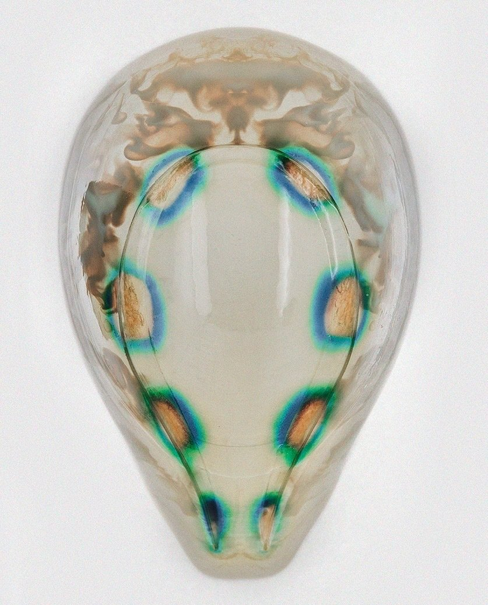

*Quand on parle d'innovation, on pense souvent aux prouesses techniques mais on oublie souvent qu'elle naisse d'une perception du monde qui engage pleinement les domaines artistiques. Dans cet article, je vous propose de découvrir comment l'art pourrait initier les révolutions technologiques du 21ème siècle.*

**Sommaire :**  
A. The Krebs Cycle of Creativity  
B. Entre Elon Musk et Yū Sasuga  
C. La biotechnologie  

---

## A. The Krebs Cycle of Creativity

Pensé par *Neri Oxman* (chercheuse au *MIT* pour le *[Mediated Matter group](https://mediatedmattergroup.com/)*), The Krebs Cycle of Creativity représente la place des quatre domaines créatifs, chacun pouvant amener une révolution en collaboration avec les autres. La conscience pure et parfaite se plaçant au centre de ces domaines.

Des sous-domaines en naissent directement, comme les humanités digitales, au croisement de l'informatique et des arts, lettres, sciences humaines et sciences sociales. La (très) bonne nouvelle dans tout ça, c’est que ces nouveaux mouvements sont souvent en faveur de la diffusion, du partage et de la valorisation du savoir. Elles éduquent et élèvent l’Homme sans que la technologie ne soit là pour l’écraser.

Pour Neri Oxman, la révolution industrielle a amené un nouveau paradigme : le monde machine ("the World as Machine"). Elle propose un nouveau modèle à l'ère digitale : le monde organisme ("the World as Organism"). Ayant étudiée la médecine et l'architecture avant de réaliser son phD en Computational Design, elle envisage des créations telle qu'une structure habitable recouverte d'une surface organique intégrant de multiples fonctions (non sans rappeller la peau qui filtre et retient).

> A good designer can, by virtue of design—both the noun and the verb—not only solve problems, but also seek them out, long before they emerge. Your work melds numerous disciplines. How do you decide what to explore?

---

## B. Entre Elon Musk et Yū Sasuga

*NeuraLink*, la startup américaine d’Elon Musk développe des interfaces cerveau-machine pour augmenter — **technologiquement** — les capacités humaines. Dans l’oeuvre fictive de Yū Sasuga – *[Terra Formars](https://www.youtube.com/watch?v=zQ-9UYfmmuU)* – les humains sont eux **génétiquement** modifiés pour s’approprier les caractéristiques d’organismes non humains comme la vision 8 fois supérieure d’un aigle.  
Ces deux mondes ne sont pas destinés à s’affronter et peuvent largement collaborer comme le suggère The Krebs Cycle of Creativity. Si Elon Musk souhaite coloniser Mars, notamment grâce au travail technique de *SpaceX*, Yū Sasuga imagine un moyen de la rendre habitable en la terraformant biologiquement.  
*Dans l'oeuvre, la surface de la planète est recouverte de lichens et de cafards afin de la réchauffer en absorbant la lumière du soleil.*

La plupart d’entre nous trouvent certainement ces perspectives improbables, voire terrifiantes pour ce qui relève de l’humain augmenté. Dans les faits et malgré la réalité scientifique, il s’agit simplement d’un état de moeurs de notre culture actuelle. Dans plusieurs décennies et, a fortiori, dans des pays telle que la Chine qui envisagent déjà la manipulation génétique pour ses enfants, ces barrières sociales devraient largement disparaître.

> « Toute vérité franchit trois étapes. D’abord, elle est ridiculisée. Ensuite, elle subit une forte opposition. Puis, elle est considérée comme ayant été une évidence. »  
– Schopenhauer

---

## C. La biotechnologie

De plus en plus loin des fantasmes artistiques, les biotechnologies sont en plein essor. Imaginez bénéficier des protéines fabriquées par le *tardigrade*, le seul être vivant capable de résister à des situations extrêmes telle que l'explosation d'une supernova ou la privation totale d'eau. Ce petit être capable de disloquer puis de réparer son propre ADN pourrait bien se révéler utile puisque *Takekazu Kunieda*, chercheur à l’université de Kyoto, a récemment identifié la protéine protégant l'ADN du *tardigrade* des radiations, protéine qui pourrait également protéger les cellules humaines.

Autre anecdote, en 2018, des babouins ont vécu six mois en bonne santé après avoir reçu une greffe de cœur issu de porcs génétiquement modifiés pour ne pas exprimer des molécules susceptibles de provoquer un rejet. Un résultat prometteur qui laisse entrevoir la possibilité de xénotransplantation chez l’être humain.  
Plus fou encore, des chercheurs ont implanté des cellules souches humaines dans des embryons porcins qui, en se développant, ont montré que les cellules humaines avaient commencé à se transformer en tissus musculaires, notamment cardiaques.

> "Le but ultime de cette expérience est de cultiver des tissus ou des organes humains (pancréas, foie, cœur…) chez des animaux, comme des truies, qui pourront ensuite être greffés sans rejet chez l’humain."  
– Carlos Izpisua Belmonte, professeur à l’Institut Salk d’études biologiques

Pour conclure cet article, je vous propose de revenir au travail de Neri Oxman. Le Mediated Matter group a récemment développé un prototype de masque, conçu par impression 3D, habité par des micro-organismes capables de détecter des indices environnementaux dans le but de produire une réponse médicale (vitamines, antibiotiques) adaptée aux conditions extérieures.  
S'il ne fait aucun doute que les biotechnologies sont le futur inconditionnel de l'humanité, reste à savoir à quel point elles seront invasives et jusqu'où l'humanité est prête à aller.

> "From a Material Ecology perspective, we are approaching a material singularity where there will be little to no distinction between “natural” and “artificial.” Designed objects, and the technologies to create them, will exhibit functionality and behavior equivalent to, or indistinguishable from, naturally derived ones."  
– Neri Oxman