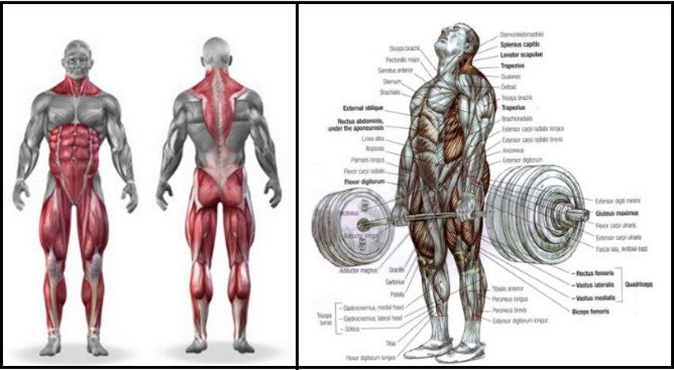

*In this article, you'll discover the different variations of deadlift and why Trap Bar Deadlifts might be the best.*

---

**[I. Deadlifts issues](#one)**  

**[II. Trap Bar Deadlifts](#two)**  
• [a. Benefits](#two-one)  
• [b. Exceptions](#two-two)  

---

## I. Deadlifts issues

Deadlift is one of the three main lifting exercises (with squat and bench press). It is a very efficient exercise that allows you to strengthen your lower-body, *erector spinae* muscles, core, and grip.

For a lot of people, reaching the floor without a spinal flexion - no matter how much mobility work they do - can be a real problem. In this case, it is highly recommended to avoid classic deadlifts and to prioritize variations such as Rack or Block pulls. Those allow you to reduce the range of motion (ROM) you'll have to travel while performing the movement. But there is - I think - a better and more convenient option which is Trap Bar Deadlifts.

---

## II. Trap Bar Deadlifts

### a. Benefits

For a lot of lifters, trap bar is such a benediction. The overall movement pattern is still similar to a conventional deadlift but it allows for more flexibility in the movement.

First of all, Trap Bar Deadlift is <mark>**easier to learn and safer for a lot of people**</mark>. The position is naturally better as the barbell is not in front of you. Moreover, most trap bars grips are raised so there is even less ROM.

It also allows you to have a <mark>**stronger and safer grip**</mark>. Indeed, Trap Bar Deadlifts don’t require a mixed grip - which is widely used to hold heavy barbells when performing straight bar deadlifts. This is preferable as mixed grip tends to cause muscle imbalances and isn’t comfortable at all for beginners.

Last but not least, Trap Bar Deadlifts allow for <mark>**higher velocity and higher power output**</mark>, which tend to ease your progressive overload on the movement.  
One of the reason is that it is proven to be easier to initialize the movement with your quads, which - if you didn't - will eventually allow you to lift more.  
But above all, it is widely corroborated by many studies. In a [study conducted in 2011](https://www.ncbi.nlm.nih.gov/pubmed/21659894), subjects were asked to perform a 1RM with both Trap Bar and Straight Barbell. The results are respectively of *265 ± 41 kg vs. 245 ± 39 kg (with a p-value under a signifiance level of 0.05)*.

In another study conducted on nineteen male powerlifters, subjects performed trials at maximum speed with loads of 10, 20, 30, 40, 50, 60, 70, and 80% of their predetermined 1-repetition maximum (1RM). Inverse dynamics and spatial tracking of the external resistance were used to quantify kinematic and kinetic variables.
> The design of the hexagonal barbell significantly altered the resistance moment at the joints analyzed (p < 0.05), resulting in lower peak moments at the lumbar spine, hip, and ankle (p < 0.05) and an increased peak moment at the knee (p < 0.05). Maximum peak power values of 4,388 ± 713 and 4,872 ± 636 W were obtained for the SBD and HBD, respectively (p < 0.05). Across the submaximal loads, significantly greater peak force, peak velocity and peak power values were produced during the HBD compared to during the SBD (p < 0.05). The results demonstrate that the choice of barbell used to perform the deadlift has a significant effect on a range of kinematic and kinetic variables. The enhanced mechanical stimulus obtained with the hexagonal barbell suggests that in general the HBD is a more effective exercise than the SBD.

---

### b. Exceptions

- If you want to focus on your hamstrings and train your terminal hip extension; a (partial) Romanian deadlift might be a better option.
- If you want to compete in powerlifting competitions, you'll need to perform with a traditional barbell.

